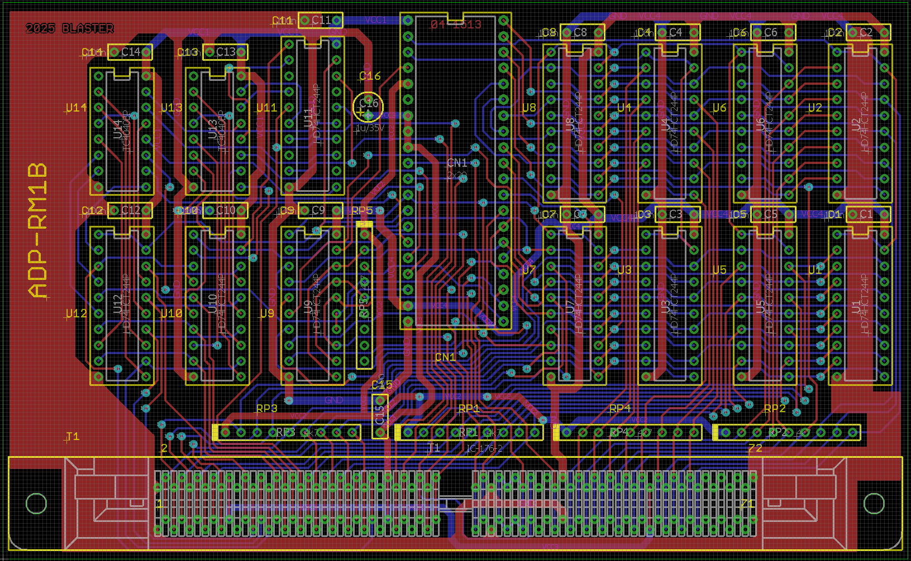
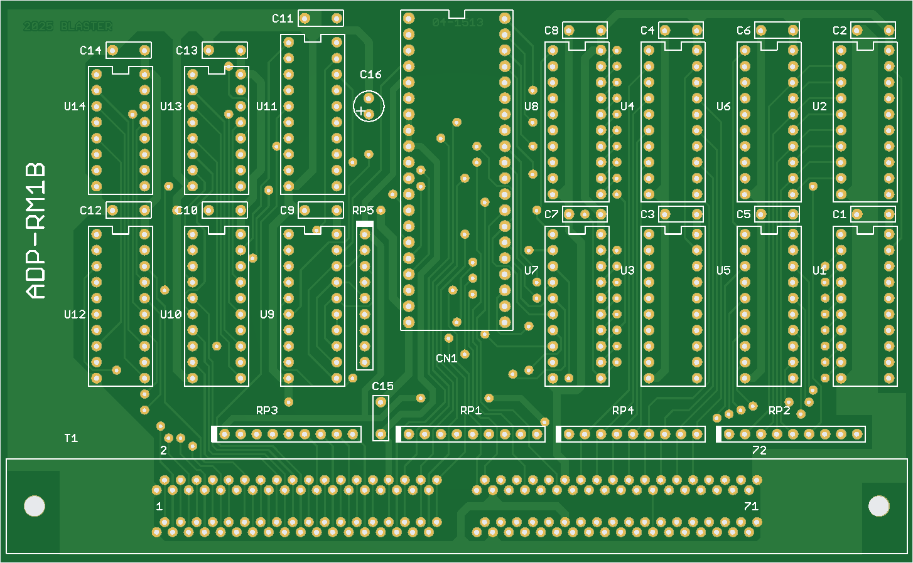
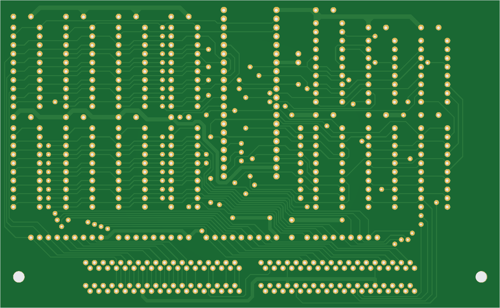

# ADP-RM1B
Original adapter for Hi-Lo Systems ALL-03, ALL-07 etc. universal programmers, exact PCB clone.

This adapter allows testing of SIMM72 DRAM memory modules.

>[!NOTE]
>This version cannot test double-sided memory modules due to missing #RAS1/3 signal.  
>Workaround: add a wire to connect pin **6** of the ZIF socket to pins **33** and **45** of the SIMM72 test socket.

This project includes:
- [Gerber files in zip for PCB manufacturing](RM1B_Gerber.zip)
- [Eagle 7 CAD schematic/board files in zip](RM1B_Eagle.zip)
- [Schematic diagram in pdf](RM1B_sch.pdf)

